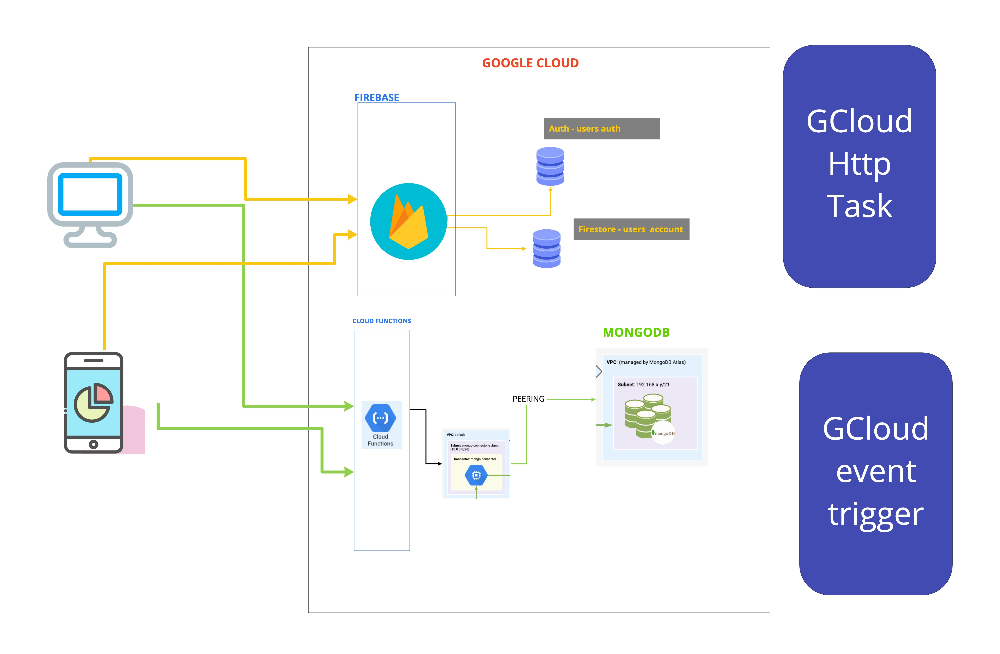

# Property_managment_communication_App
This repo is to showcase my progress while creating the app/service that will focus on Increasing better communication between property managers (community, apartments) and the clients they serve

# Overview
The PROPERTY MANAGER is totally accountable for all community operations. The purpose of the PROPERTY MANAGER is to effectively manage 
and coordinate persons, activates,and available resources in order to accomplish community objectives as set forth by the Regional Property Manager and property owner.

# Issue
As a current person living in a community managed by a property managers, I realized that often the emails from my property managers were often unread or they were been read often too late. That is because most people prioritized work emails and other expected emails. Emails are a greate way to communicate; however it is a very crowded channel to communicate, and emails can get lost very easily

# Solution
The solution is to bring all users/resident in one channel were they are expected to only get notification about their property, community or apartment complex

# Key features (Mobile App and Website Dashboard)
### Property Managers will be able to:
- create a project
- invite their residents and staff to subscribe to the project's channel
- send Announcements notifications
- send Events notifications:
    - events will have a calendar date which will automatically add the date to users Mobile calendar
- create details informations about the Ammenities.

### Residents will be able to:
- read and save Announcments and Events
- write post on the communty channel to communicate to neighbors (Example: Lost dog)
- set remnders
- send maintenance request
etc.

# Architecture
- the architecture will use:
    - Gcloud serverless Functions (Node.js)
    - the mobile app is beeing built using Flutter
    - Database : MongoDb and Firestore
<!--  -->

